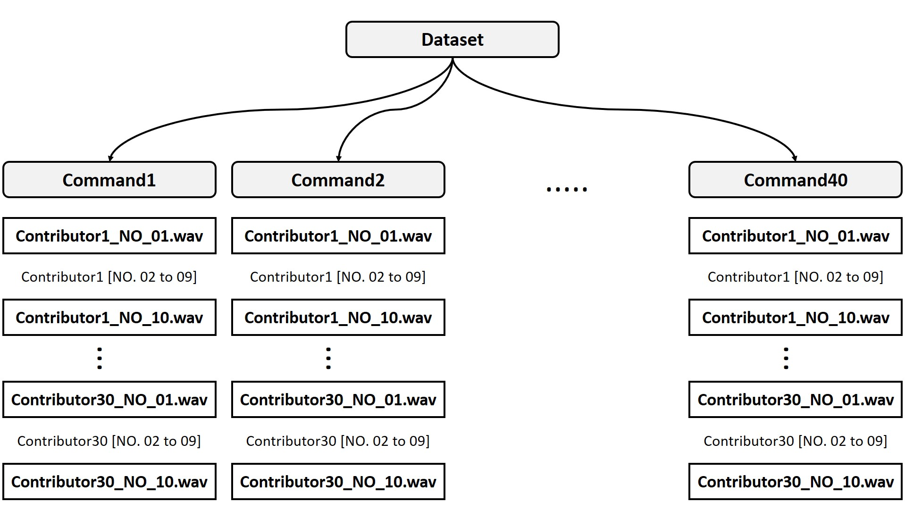
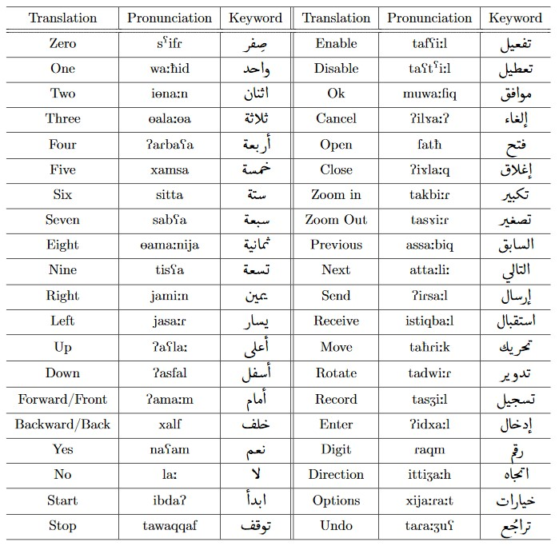

# Arabic Speech Commands Dataset

This dataset is designed to help train simple machine learning models that serve educational and research purposes in the speech recognition domain, mainly for keyword spotting tasks.

## Dataset Description

Our dataset is a list of pairs *(x, y)*, where *x* is the input speech signal, and *y* is the corresponding keyword. 
The final dataset consists of 12000 such pairs, comprising 40 keywords. 
Each audio file is one-second in length sampled at 16 kHz. 
We have 30 participants, each of them recorded 10 utterances for each keyword. 
Therefore, we have 300 audio files for each keyword in total (30 * 10 * 40 = 12000), 
and the total size of all the recorded keywords is ~384 MB. 
The dataset also contains several background noise recordings we obtained from various natural sources of noise. 
We saved these audio files in a separate folder with the name **background_noise** and a total size of ~49 MB. 

## Dataset Structure

There are 40 folders, each of which represents one keyword and contains 300 files.
The first eight digits of each file name identify the contributor, while the last two digits identify the round number.
For example, the file path **rotate/00000021_NO_06.wav** indicates that the contributor with the ID **00000021** pronounced the keyword **rotate** for the 6<sup>th</sup> time.
The final structure of the dataset is shown in the figure below:



## Table of Keywords

The table below lists the 40 chosen keywords with their translations into Arabic and pronunciations in the International PhoneticAlphabet (IPA).



## Data Split

We recommend using the provided CSV files in your experiments. 
We kept 60% of the dataset for training, 20% for validation, and the remaining 20% for testing. 
In our split method, we guarantee that all recordings of a certain contributor are within the same subset.

## License

This dataset is licensed under the 
[Creative Commons Attribution 4.0 International (CC BY 4.0)](https://creativecommons.org/licenses/by/4.0/) license.
For more details, see the LICENSE file in this folder.

## Citations

If you want to use the Arabic Speech Commands dataset in your work, please cite it as:

```
@article{arabicspeechcommandsv1,
   author = {Ghandoura, Abdulkader and Hjabo, Farouk and Al Dakkak, Oumayma},
    title = {Building and Benchmarking an Arabic Speech Commands Dataset for Small-Footprint Keyword Spotting},
  journal = {Engineering Applications of Artificial Intelligence},
     year = {2021},
  publisher={Elsevier}
}
```
